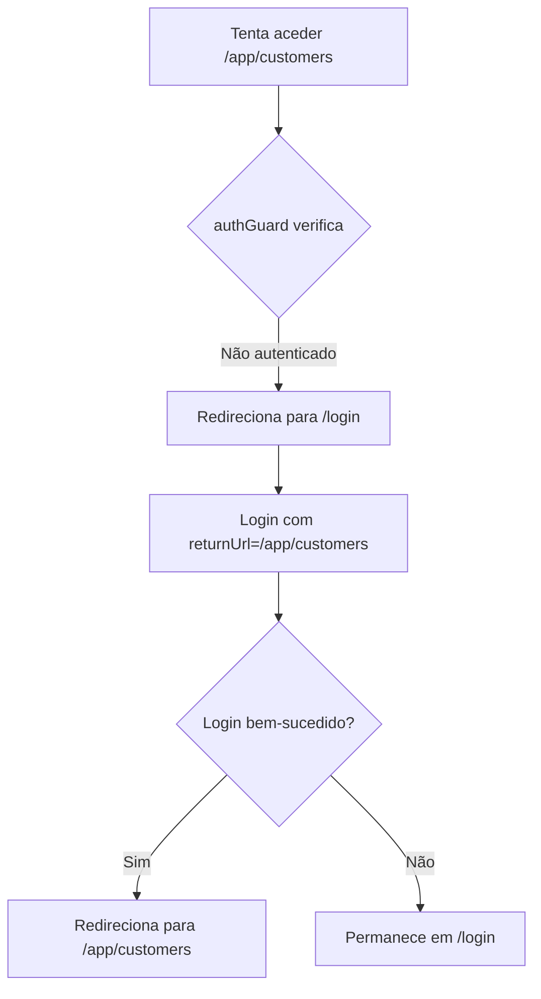
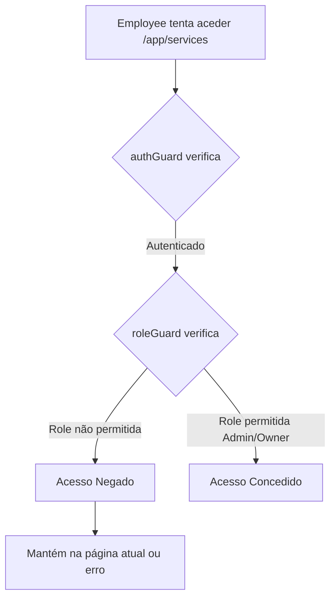

# 🗺️ Fluxo de Navegação - MechaSoft

## 📋 Estrutura de Rotas

### 🌐 Rotas Públicas (Não Autenticadas)

| Rota | Componente | Descrição |
|------|-----------|-----------|
| `/` | `LandingComponent` | Página inicial pública com apresentação do sistema |
| `/login` | `LoginComponent` | Página de autenticação |
| `/404` | `ErrorComponent` | Página de erro 404 |

---

### 🔐 Rotas Privadas - Sistema de Gestão `/app`

**Protegidas por:** `authGuard` (requer autenticação)

#### Fluxo de Entrada
```
/login (autenticação bem-sucedida) → /app → /app/home
```

#### Rotas Disponíveis

| Rota | Componente | Guard | Roles Permitidas | Descrição |
|------|-----------|-------|------------------|-----------|
| `/app` | → redirect → `/app/home` | `authGuard` | Todas | Redireciona para home |
| `/app/home` | `FrontHomeComponent` | `authGuard` | Todas | **Página inicial** do sistema autenticado |
| `/app/dashboard` | `DashboardComponent` | `authGuard` | Todas | Dashboard com estatísticas e métricas |
| `/app/customers` | `CustomersComponent` | `authGuard` + `roleGuard` | Employee, Admin, Owner | Gestão de clientes |
| `/app/vehicles` | `VehiclesComponent` | `authGuard` | Todas | Gestão de veículos |
| `/app/service-orders` | `ServiceOrdersComponent` | `authGuard` | Todas | Gestão de ordens de serviço |
| `/app/inspections` | `InspectionsComponent` | `authGuard` | Todas | Gestão de inspeções técnicas |
| `/app/services` | `ServicesComponent` | `authGuard` + `roleGuard` | Admin, Owner | Catálogo de serviços |
| `/app/parts` | `PartsComponent` | `authGuard` + `roleGuard` | Employee, Admin, Owner | Gestão de peças |

---

### 🔮 Rotas Futuras - Back-Office `/admin`

**Reservado para funcionalidades administrativas avançadas**

---

## 🔄 Fluxos de Navegação

### 1️⃣ Utilizador Não Autenticado

```mermaid
graph TD
    A[Acesso à aplicação] --> B{Está autenticado?}
    B -->|Não| C[Landing Page /]
    C --> D[Clica 'Acesso Funcionários']
    D --> E[Login /login]
    E --> F{Credenciais válidas?}
    F -->|Sim| G[Redireciona para /app]
    G --> H[/app/home - Página Inicial]
    F -->|Não| I[Mostra erro]
    I --> E
```

### 2️⃣ Utilizador Autenticado (Employee/Admin/Owner)

```mermaid
graph TD
    A[Login bem-sucedido] --> B[/app]
    B --> C[/app/home]
    C --> D{Escolhe ação}
    D --> E[Nova Ordem de Serviço]
    D --> F[Novo Cliente]
    D --> G[Agendar Inspeção]
    D --> H[Ver Dashboard]
    D --> I[Aceder Módulos]
    
    E --> J[/app/service-orders]
    F --> K[/app/customers]
    G --> L[/app/inspections]
    H --> M[/app/dashboard]
    I --> N[/app/vehicles]
    I --> O[/app/services]
    I --> P[/app/parts]
```

### 3️⃣ Acesso a Rota Protegida sem Autenticação



### 4️⃣ Acesso com Permissões Insuficientes



---

## 🎯 Página Inicial do Sistema Autenticado

### `/app/home` - Nova Página de Boas-Vindas

**Características:**
- ✨ Design moderno com gradientes e animações
- 🚀 Ações rápidas (Nova Ordem, Novo Cliente, Inspeção, Dashboard)
- 📦 Grid de todos os módulos disponíveis
- 🎨 Visual consistente com a landing page pública
- 📱 Totalmente responsivo

**Propósito:**
- Página de entrada amigável após login
- Acesso rápido às funcionalidades mais usadas
- Navegação intuitiva para todos os módulos

---

## 📊 Diferença: Home vs Dashboard

| Aspecto | `/app/home` | `/app/dashboard` |
|---------|-------------|------------------|
| **Função** | Página de boas-vindas e navegação | Métricas e análise de dados |
| **Conteúdo** | Links para módulos e ações rápidas | Estatísticas, gráficos, tabelas |
| **Quando usar** | Primeira visita após login | Análise de performance do negócio |
| **Design** | Visual moderno, inspirador | Funcional, orientado a dados |
| **Público-alvo** | Todos os utilizadores | Gestores e administradores |

---

## 🔐 Sistema de Guards

### authGuard
- **Localização:** `core/guards/auth.guard.ts`
- **Função:** Verifica se o utilizador está autenticado
- **Ação se falhar:** Redireciona para `/login` com `returnUrl`

### roleGuard
- **Localização:** `core/guards/role.guard.ts`
- **Função:** Verifica se o utilizador tem a role necessária
- **Ação se falhar:** Bloqueia acesso (mantém na página atual)

---

## 🎭 Roles e Permissões

| Role | Descrição | Acesso |
|------|-----------|--------|
| **Owner** | Proprietário | Acesso total a tudo |
| **Admin** | Administrador | Acesso a quase tudo exceto configurações críticas |
| **Employee** | Funcionário | Acesso ao sistema de gestão diário |
| **Customer** | Cliente | Portal de cliente (futuro - `/portal`) |

---

## 📝 Resumo do Fluxo Atual

1. **Landing** (`/`) → Página pública
2. **Login** (`/login`) → Autenticação
3. **Home** (`/app` ou `/app/home`) → **Página inicial do sistema** ⭐
4. **Dashboard** (`/app/dashboard`) → Estatísticas e métricas
5. **Módulos** (`/app/customers`, `/app/vehicles`, etc.) → Funcionalidades específicas

---

## 🔄 Alterações Recentes (2025-10-09)

### ✅ Mudanças Implementadas:

1. **Rota padrão alterada**
   - Antes: `/app` → `/app/dashboard`
   - Agora: `/app` → `/app/home`

2. **Login atualizado**
   - Antes: Login → `/app/dashboard`
   - Agora: Login → `/app` → `/app/home`

3. **Nova home criada**
   - Design moderno inspirado na landing page
   - Ações rápidas para tarefas comuns
   - Grid completo de todos os módulos

4. **Dashboard mantido**
   - Continua disponível em `/app/dashboard`
   - Focado em estatísticas e análise de dados
   - Acessível via menu ou link da home

---

## 🚀 Próximos Passos Sugeridos

- [ ] Adicionar breadcrumbs para melhor navegação
- [ ] Implementar notificações em tempo real
- [ ] Criar portal de cliente (`/portal`)
- [ ] Adicionar tema escuro/claro
- [ ] Implementar favoritos/atalhos personalizados

---

**Data de Atualização:** 9 de Outubro de 2025  
**Versão:** 2.0.0  
**Status:** ✅ Implementado e Testado

